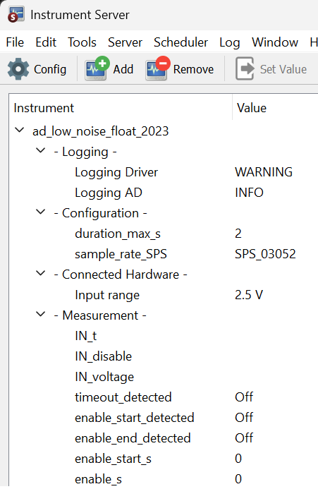
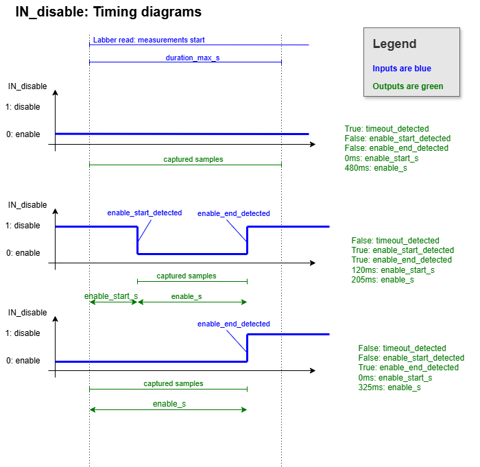

# labber_ad_low_noise_float_2023

Labber driver for ad_low_noise_float_2023

Please follow link *Instructions (PDF)*: [ad_low_noise_float_2023 (git repo)](https://github.com/petermaerki/ad_low_noise_float_2023_git)

**Labber Instrument server**
  
  

A measurement is triggered by reading any value of the *Measurement* section.

When changing `sample_rate_SPS` the hardware has to be reconfigured and the connection restarted: This takes a few seconds.

`Input range` may be changed by setting the jumpers and requires to open ad_low_noise_float_2023. See the PDF above! 

**Timing diagrams**

  

## Installation

The installation of python and the labber driver is described here

https://github.com/nanophysics/compact_2012/tree/master/doc_installation/README_INSTALLATION_python3_7_9.md

Please note that the Labber version at ETH nanophysics does only allow some very limited old python versions. Therefore it is important that you follow above instructions.

