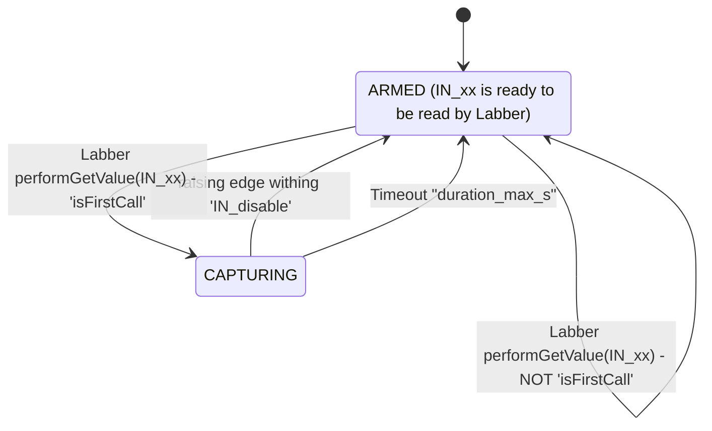

# Design

## Digital inputs

Schematics see `pcb_ad_low_noise_float_2023.pdf`:

Terms related to `IN_disable` and `IN_t`:

* `True`, `False` is used for logical state.
* `0V` and `3V3` is used for electrical state.
* `ERROR_STATUS_J44` in the python driver is the logical state.

Pins

* IN_disable, J45
* IN_t, J46

BNC and Jumper

* In BNC is NOT connected: `IN_disable` and `IN_t` are `False`.
* On PCB J45/J46: `0` corresponds to `True`
* Setting a Jumper on J54/J46 corresponds to `True` - see table below

Instead of applying input voltages to `IN_disable` and `IN_t`, the jumpers may be closed.

| Jumper | Signal | Logical state when Jumper closed |
| :-: | :-: | :-: |
| J45 | IN_disable | disabled |
| J46 | IN_t | triggered |


## Trigger mechanism

`IN_xx` stands for `IN_voltage, IN_disable and IN_t`




When the Labber Measurement reads the first `IN_xx` (isFirstCall) it will trigger the states `Armed` -> `Record` -> `Idle`.

When the data is ready, the result and the control will be returned to Labber.

### Labber Driver Implementation

The driver implementation is based on [ad_low_noise_float_2023_git](https://github.com/petermaerki/ad_low_noise_float_2023_git).

The protocol is described here [README_measurements_protocol.md](https://github.com/petermaerki/ad_low_noise_float_2023_git/blob/main/software/doc/README_measurements_protocol.md)

The layering of the driver

| Layer | Language | Repo |
| - | - | - |
| Hardware/PCB | KiCad | https://github.com/petermaerki/ad_low_noise_float_2023_git/tree/main/hardware |
| Pico Software | C | https://github.com/petermaerki/ad_low_noise_float_2023_git/tree/main/software/pico |
| Driver | Python | https://github.com/petermaerki/ad_low_noise_float_2023_git/blob/main/pyproject.toml |
| Protocol Encoder | C++ | https://github.com/petermaerki/ad_low_noise_float_2023_git/tree/main/software/decoder | 
| This Labber driver | Python | https://github.com/nanophysics/labber_ad_low_noise_float_2023 |


## Testing with pico board

The triggering may be tested using a pico board.

This labber driver `ad_low_noise_float_2023_stimuli` allows to test `ad_low_noise_float_2023`.
It may produces signals with given timings to provoke verious reading situations in `ad_low_noise_float_2023`.

### Outputs

* IN_t
  
  bool

* IN_disable
  
  bool

* IN_voltage
  
  float (IN_P_0V, IN_P_0V7, IN_P_3V3)


## Run scenarios from the command line

```bash
cd stimuli_src_micropython
uvx mpremote run init.py
uvx mpremote resume run scenario_04_test_enable_disable.py exec 'run_scenario(run_synchron=True, do_validate=False, do_log=True)'
```

There is no feedback on the terminal.
