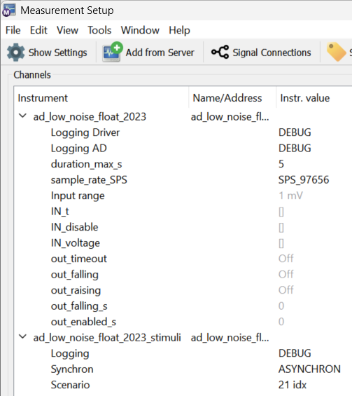
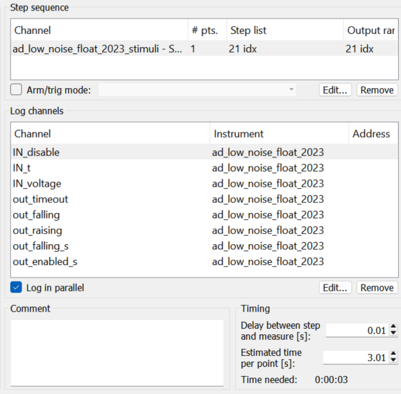

## Reengineering `performGetValue` and `firstCall`

### Instrument Server

FIRST: IN_t -> right mouse click -> GetValue
FIRST: IN_disable -> right mouse click -> GetValue
FIRST: IN_volatage -> right mouse click -> GetValue

**Summary**: FIRST is always triggered - it is not possible the get all three arrays from one 'shot'.

### Measurement Server

Logging Driver: INFO
Logging AD: INFO






```
INFO:LabberDriver:performGetValue('IN_voltage') FIRST
INFO:LabberDriver:performGetValue('IN_t')
INFO:LabberDriver:performGetValue('IN_disable')
INFO:LabberDriver:performGetValue('IN_voltage') FIRST
INFO:LabberDriver:performGetValue('IN_t')
INFO:LabberDriver:performGetValue('IN_disable')
INFO:LabberDriver:performGetValue('IN_voltage') FIRST
INFO:LabberDriver:performGetValue('IN_t')
INFO:LabberDriver:performGetValue('IN_disable')
```

**Summary** A measurement always starts with a 'FIRST'. This shall be used as a trigger to arm the statemachine.
