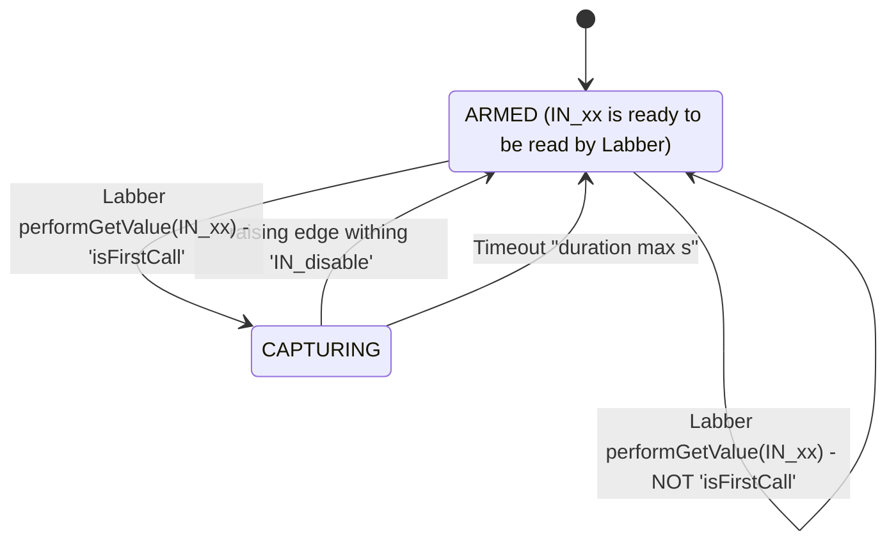

# User Manual

## Features

* 

## Trigger mechanism

`IN_xx` stands for `IN_voltage, IN_disable and IN_t`

When the Labber Measurement reads the first `IN_xx` (isFirstCall) it will trigger the states `Armed` -> `Record` -> `Idle`.

When the data is ready, the result and the control will be returned to Labber.

## Labber Instrument Settings

**TODO: describe/review**

| Category | Name | Values | Comment |
| - | - | - | - |
| `Config` | `Axis` | [AXIS2,AXIS3] | - |
| `Control` | `Logging` | [DEBUG,INFO,WARNING] | - |
| `Control` | `Mode` | [PASSIVE,RAMPING_WAIT] | see below |
| `Control` | `Labber State` | many | see below |
| `Control` | `Field Setpoint X, Y, Z` | float | [T] target field |
| `Control` | `Hold Switchheater on Z` | [False, True] | False: cool down switchheater (slow) |
| `Control` | `Hold Current Z` | [False,True] | If switchheater is cold: True: hold current False: do zerocurrent |
| `Control` | `Ramp Rate X, Y, Z` | float | [T/s] ramping speed |
| `Status` | `Switchheater Status Z` | [OFF, ON] | current state of the switchheater |
| `Status` | `Field actual X, Y, Z` | float | measured field [T] |
| `Status` | `Magnet State X, Y, Z` | many | see below |

### Labber Driver Implementation

The driver implementation is based on [ad_low_noise_float_2023_git](https://github.com/petermaerki/ad_low_noise_float_2023_git).

The protocol is described here [README_measurements_protocol.md](https://github.com/petermaerki/ad_low_noise_float_2023_git/blob/main/software/doc/README_measurements_protocol.md)

The layering of the driver

| Layer | Language | Repo |
| - | - | - |
| Hardware/PCB | KiCad | https://github.com/petermaerki/ad_low_noise_float_2023_git/tree/main/hardware |
| Pico Software | C | https://github.com/petermaerki/ad_low_noise_float_2023_git/tree/main/software/pico |
| Driver | Python | https://github.com/petermaerki/ad_low_noise_float_2023_git/blob/main/pyproject.toml |
| Protocol Encoder | C++ | https://github.com/petermaerki/ad_low_noise_float_2023_git/tree/main/software/decoder | 
| This Labber driver | Python | https://github.com/nanophysics/labber_ad_low_noise_float_2023 |

### Control / Labber State

**TODO: describe/review**

The code implementing this table is implemented in `class LabberState()` in `AMI430_visa.py`.

| Name | set by | comment |
| - | - | - |
| `RAMPING` | Labber | Labber driver will return immediately and start ramping towards the “field setpoint”. As soon as “field setpoint” is reached: switch to HOLDING |
| `HOLDING` | Magnet | |
| `PAUSED` | Labber | Labber driver will return immediately and stop ramping |
| `IDLE` | Magnet | ... |
| `MISALIGNED` | Magnet | The three magnets are NOT in the same state. As long a s the state is misaligned Labber can not measure the log channels. |
| `ERROR` | Magnet | At least one magnet is in error state |

# The labber driver 

**TODO: describe/review**

The labber driver handles the communication of labber and the magnet programmers. The labber driver opens a thread, that manages the communciations between Labber and the logging described below. The thread ensures that no synchronization issues arise when Labber and the Log symulateously try to communicate with the AMI 430 programmer.

# The log file

**TODO: describe/review**

The motivation behind the log file is first for easier debuging and equally important to check the stability of the magnetic field. To motivate this we need to go further into the details of the AMI430 programmer module. 

It uses some PID type controller to reach the desired magnetic field setpoint. One does not have a direct control over the indivudual PID settings of the magnet. The handle to this controller is the stability parameter. It is a number between 0 and 100. According to the manual it is defined as follows: 

